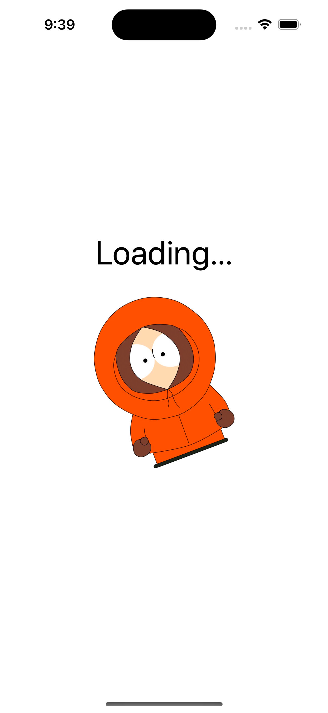
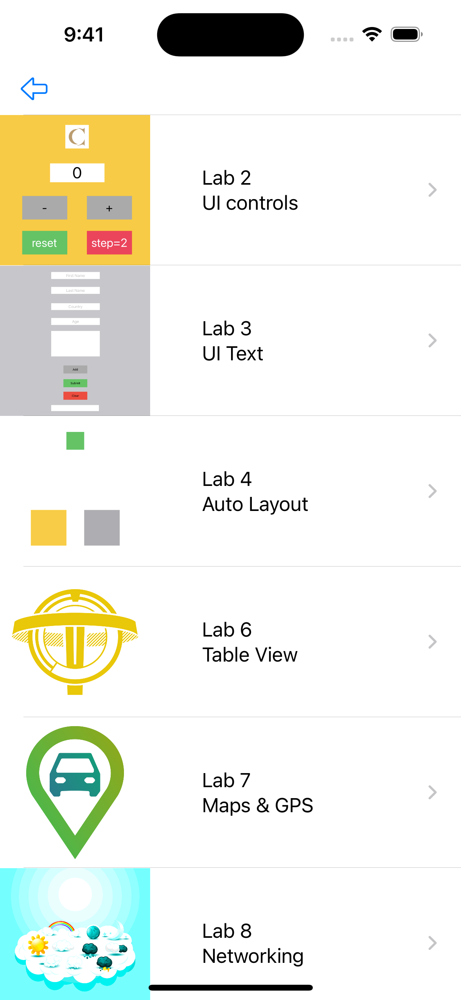

# PROG8470-IOS-Final-Summary-Storyboards

Final Exam project of PROG8470 IOS development of Conestoga College. This app combine previous projects together, to list them in a tableView, tap can navigate to target storyboard.

## Launch Screen

## Projects List

## Core code: programmatically Navigation

[How to Navigate to Different viewControllers via Dynamic Table Cell?](https://sliu9412.notion.site/How-to-Navigate-to-Different-viewControllers-via-Dynamic-Table-Cell-30be72a542824b479c03cc9d85739053?pvs=4)
